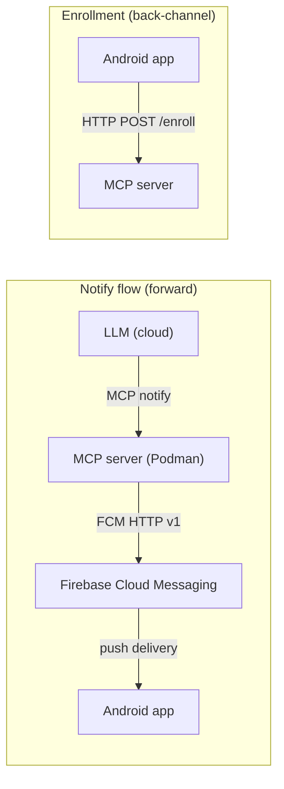
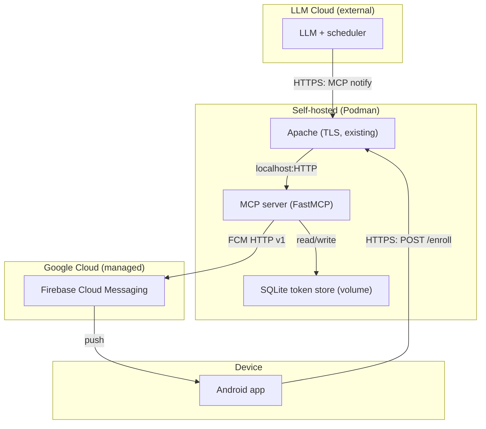
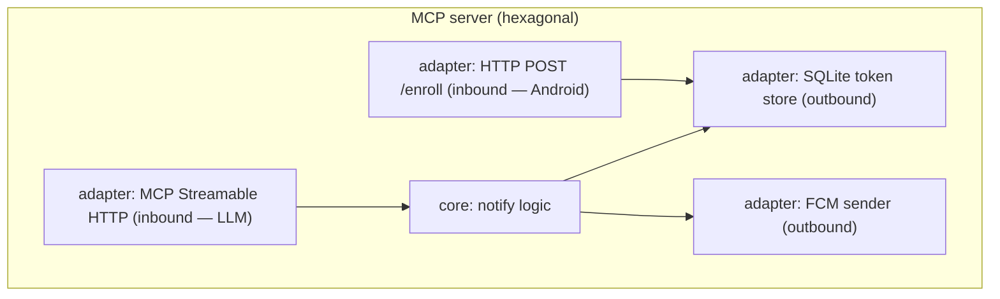

# Architecture Spine — mcp-notif

## Design Paradigm

**Hexagonal (ports & adapters)** for the MCP notification server. The `notify` tool logic is the application core; the MCP Streamable HTTP transport is the primary inbound adapter (for the LLM's `notify` tool); a plain HTTP POST `/enroll` endpoint is the second inbound adapter (for the Android app's device-token enrollment). The Firebase Admin SDK (FCM HTTP v1) is the outbound adapter for push delivery; a SQLite token store is the outbound adapter for device-token persistence. The Android app is a thin receptor — not an architectural unit in V1.

System-level topology is **pipes-and-filters** for the notify flow (each stage transforms and forwards, strictly one-way) with a **back-channel** for enrollment (Android app calls the MCP server's `/enroll` endpoint to register its FCM token).

```
mcp-notif/
  mcp-server/          # Python — MCP notification server (hexagonal core + adapters)
    src/
      core/            # notify tool logic (application core, no I/O)
      adapters/
        inbound/       # MCP Streamable HTTP (FastMCP) + HTTP POST /enroll (enrollment)
        outbound/      # FCM sender (firebase-admin SDK) + SQLite token store
    Containerfile      # Podman image
  android-app/         # Kotlin — FCM receiver, detail view, enrollment on startup/token rotation
```

## Invariants & Rules

### AD-1 — `notify` tool input schema

- **Binds:** `notify-tool`, LLM caller
- **Prevents:** The LLM and MCP server disagreeing on the tool's input contract; oversized payloads silently rejected by FCM
- **Rule:** The `notify` tool accepts exactly three string fields — `title`, `short_message`, `detailed_message`. No optional fields in V1. All three are required, non-empty. Maximum UTF-8 byte lengths: `title` <= 100, `short_message` <= 500, `detailed_message` <= 3500. The MCP server MUST validate these before sending to FCM and return `type: "validation_error"` on violation. Limits account for FCM's 4 KB total data payload constraint with headroom for key names and encoding overhead.

### AD-2 — FCM message contract

- **Binds:** `fcm-bridge`, `android-receiver`
- **Prevents:** The MCP server and Android app building incompatible message shapes; foreground/background delivery-path divergence
- **Rule:** The MCP server sends an FCM **data-only** message — NOT a data+notification message. The data payload contains all three fields: `data: { title, short_message, detailed_message }`. The Android app's `FirebaseMessagingService.onMessageReceived` is always called for data-only messages regardless of app state (foreground or background). The service builds the system notification from `title` + `short_message` and stores `detailed_message` in the PendingIntent for the detail view. The Android app MUST use `NotificationCompat.BigTextStyle` to display `short_message` so the full text is visible without truncation. The notification channel is created with `IMPORTANCE_DEFAULT`; channel ID is a constant defined by the Android app. The Android app MUST ignore any FCM data keys other than the three defined here. The MCP server MUST NOT add data keys not defined in this AD. This is the only shared data contract between the two built units.

### AD-3 — Minimal persistence (device token only)

- **Binds:** `notify-tool`, `fcm-bridge`, `enrollment-endpoint`, `token-store`
- **Prevents:** Session affinity requirements, stateful scaling, drift between restarts, over-engineering a database for a single-token store
- **Rule:** The MCP server holds no session state and no notification history. The only persistent state is the SQLite token store: exactly one table (`device_token`), exactly one row (`id=1`). No additional tables, no additional databases, no additional SQLite files. Schema migrations are not needed in V1 (the schema is defined in AD-13 and created at startup). The SQLite file is volume-mounted so it survives container restarts.

### AD-4 — Bearer token auth `[ADOPTED]`

- **Binds:** `notify-tool`, inbound transport
- **Prevents:** Open internet exposure of the `notify` tool
- **Rule:** The MCP server validates a static bearer token (`MCP_AUTH_TOKEN`) in the `Authorization` header on every MCP transport request (the `notify` tool). The `/enroll` endpoint uses a separate token (`ENROLLMENT_TOKEN`, see AD-12). Reject with 401 on mismatch. No mTLS, no OAuth2 server, no rate limiting in V1. The brief delegated the auth model to architecture; this decision adopts static bearer token as the V1 model.

### AD-5 — Dependency direction (forward notify + back-channel enrollment)

- **Binds:** all units
- **Prevents:** Circular dependencies, uncontrolled back-channels from Android to MCP server
- **Rule:** The notify flow is strictly one-way: `LLM → MCP server → FCM → Android app`. The Android app makes no calls to the MCP server for notifications. Enrollment is the only permitted back-channel: `Android app → MCP server /enroll`. The enrollment endpoint writes only to the token store; the notify tool reads only from the token store. No circular dependency exists — enrollment and notify never call each other. The Android app makes no other calls to the MCP server.



### AD-6 — State ownership

- **Binds:** all units
- **Prevents:** Two units claiming ownership of the same data
- **Rule:** LLM owns scheduling logic, task analysis, and notification formulation. MCP server owns device token persistence (SQLite — the single token row). FCM owns message delivery and device token registration. Android app owns token generation, rotation detection, and transient notification display (no persistence in V1). Token lifecycle split: Android generates → enrollment endpoint receives → SQLite persists → notify tool reads.

### AD-7 — Configuration via environment

- **Binds:** `notify-tool`, `fcm-bridge`, `android-receiver`, `enrollment-endpoint`, `token-store`
- **Prevents:** Secrets or config baked into images or source
- **Rule:** MCP server reads `FCM_SERVICE_ACCOUNT_PATH`, `MCP_AUTH_TOKEN` (LLM auth), `ENROLLMENT_TOKEN` (enrollment auth, separate from MCP_AUTH_TOKEN), and `TOKEN_DB_PATH` (optional, default `/data/device_token.db`) from env vars. The device token is no longer set via env var — it is read from the SQLite store at runtime (populated via enrollment endpoint). Android app uses standard `google-services.json` for Firebase config and stores the enrollment endpoint URL and `ENROLLMENT_TOKEN` in its config.

### AD-8 — Error propagation to LLM

- **Binds:** `notify-tool`, `fcm-bridge`, `token-store`
- **Prevents:** Silent failures, unobservable push errors; LLM unable to distinguish retry-safe from retry-pointless errors
- **Rule:** If the FCM push fails, the `notify` tool returns a structured error to the LLM caller (error type + message). The MCP server does not retry on its own in V1 — the LLM decides retry or skip. Success returns a confirmation with the FCM message ID. The `type` field MUST be one of exactly: `"validation_error"` (input fields failed local validation, do not retry), `"no_device_enrolled"` (token store empty or missing — no device has enrolled, do not retry; user action required), `"store_unavailable"` (local SQLite store inaccessible — retry after backoff), `"fcm_unregistered"` (404 — token invalid, do not retry), `"fcm_invalid_argument"` (400 — payload rejected, do not retry), `"fcm_permission_denied"` (403 — service account misconfigured, do not retry), `"fcm_throttled"` (429 — retry after backoff), `"fcm_internal"` (5xx — retry), `"network_error"` (unreachable — retry). The `message` field is a human-readable detail string. The LLM uses `type` to decide retry vs. skip.

### AD-9 — TLS via existing Apache reverse proxy

- **Binds:** inbound transport, deployment
- **Prevents:** Plaintext MCP traffic over the internet
- **Rule:** An existing Apache reverse proxy terminates TLS and forwards to the MCP server listening on localhost inside the container. The MCP server itself never handles TLS directly. Apache is already in place — no additional reverse proxy is deployed.

### AD-10 — Structured stdout logging

- **Binds:** `notify-tool`, `fcm-bridge`
- **Prevents:** Unobservable runtime behavior without persistence coupling
- **Rule:** One structured JSON log line per `notify` call to stdout (request ID, result, latency, error if any). No file-based logging, no log aggregation in V1. Container captures stdout.

### AD-11 — Device token lifecycle ownership

- **Binds:** `android-receiver`, `fcm-bridge`, `notify-tool`, `enrollment-endpoint`, `token-store`
- **Prevents:** Silent token staleness; two units disagreeing on who owns token generation, rotation detection, and staleness surfacing
- **Rule:** The Android app owns device token generation and rotation detection. The Android app MUST implement `FirebaseMessagingService.onNewToken` and POST the new token to the MCP server `/enroll` endpoint (AD-12) on initial startup and on every rotation. The MCP server persists the token in SQLite (AD-13) and the notify tool reads it at send time. Token staleness is detected via FCM `UNREGISTERED` error (404), which the MCP server propagates to the LLM as error type `"fcm_unregistered"` (per AD-8). If the enrollment endpoint is unreachable, the Android app surfaces the failure to the user and retries with backoff. The `enrolled_at` column in the SQLite store is metadata only and MUST NOT be used for staleness detection — FCM `UNREGISTERED` is the only staleness signal in V1.

### AD-12 — Enrollment endpoint contract

- **Binds:** `enrollment-endpoint`, `android-receiver`, `token-store`
- **Prevents:** The Android app and MCP server disagreeing on the enrollment API; the enrollment endpoint and notify tool using incompatible auth
- **Rule:** The MCP server exposes a plain HTTP endpoint (NOT an MCP tool — the Android app does not speak MCP) at `POST /enroll`. FastMCP 4.x generates a standard ASGI application; the server mounts FastMCP inside a FastAPI or Starlette app and adds `/enroll` as a custom route alongside the MCP Streamable HTTP transport — same process, same port. Request: `Authorization: Bearer <ENROLLMENT_TOKEN>` header (distinct from `MCP_AUTH_TOKEN` used by the LLM), JSON body `{ "device_token": "<FCM token string>" }`. Success response: `200 OK` with `{ "status": "enrolled" }`. Error responses: `401` for missing/incorrect enrollment token, `400` for missing or empty `device_token` field. The endpoint writes the token to the SQLite store (AD-13) using INSERT OR REPLACE (overwrite semantics — last enrollment wins). The endpoint MUST NOT accept any other fields in the body. The endpoint MUST NOT trigger a notification. The endpoint goes through Apache TLS termination (AD-9) like the MCP transport.

### AD-13 — SQLite token store

- **Binds:** `token-store`, `enrollment-endpoint`, `notify-tool`
- **Prevents:** Token loss on container restart; unstructured token storage; the enrollment writer and notify reader disagreeing on storage format
- **Rule:** The device token is persisted in a SQLite file. Schema: a single table `device_token` with columns `id INTEGER PRIMARY KEY DEFAULT 1`, `token TEXT NOT NULL`, `enrolled_at TEXT NOT NULL` (format: `%Y-%m-%dT%H:%M:%SZ` — second precision, UTC 'Z' suffix). A single row is enforced (`id=1`). The table MUST be created at server startup, before either inbound adapter accepts requests, via `CREATE TABLE IF NOT EXISTS device_token (...)`. Enrollment writes via `INSERT OR REPLACE INTO device_token (id, token, enrolled_at) VALUES (1, ?, ?)`. The notify tool reads via `SELECT token FROM device_token WHERE id = 1`. Every connection MUST set `PRAGMA journal_mode=WAL` and `PRAGMA busy_timeout=5000` to prevent SQLITE_BUSY errors from concurrent read-write access. File path configured by `TOKEN_DB_PATH` env var, default `/data/device_token.db` inside the container. The file MUST be on a volume mount so it persists across container restarts. If the store is empty, the file is missing, OR the table is missing when `notify` is called, the server returns error type `"no_device_enrolled"` (per AD-8 — do not retry, user action required). If the SQLite file is present but corrupt (unopenable or query raises `DatabaseError`), the server catches the exception and returns error type `"store_unavailable"` (per AD-8 — retry after backoff; requires operator intervention to delete or restore the file).

## Consistency Conventions

| Concern | Convention |
| --- | --- |
| Naming | `snake_case` for Python (server), `camelCase` for Kotlin (Android). MCP tool name: `notify`. FCM data keys: `title`, `short_message`, `detailed_message` (snake_case, matches tool fields). Enrollment endpoint: `/enroll` (lowercase, no trailing slash). |
| Data & formats | All fields are UTF-8 strings. No timestamps in V1 notification payloads. Error shape: `{ "error": { "type": "...", "message": "..." } }` returned as MCP tool error. Enrollment request: `{ "device_token": "..." }`. Enrollment success: `{ "status": "enrolled" }`. |
| State & cross-cutting | No shared mutable state except the SQLite token store (single row, write from enrollment endpoint, read from notify tool). SQLite in WAL mode with `busy_timeout=5000` to allow concurrent read-write without SQLITE_BUSY. Table created at startup. Config via env vars (server) / google-services.json (Android). Auth: bearer token on every request — `MCP_AUTH_TOKEN` for LLM/notify, `ENROLLMENT_TOKEN` for Android/enrollment. Async: MCP server runs async (FastMCP is async-native; all tool handlers and endpoint handlers are async functions). SQLite access is synchronous (stdlib `sqlite3`); the async handlers call it in a thread executor or accept the blocking cost for a single-row read/write. |

## Stack

| Name | Version |
| --- | --- |
| Python | 3.12+ (firebase-admin 7.5.0 requires 3.10+; 3.12 avoids near-term EOL) |
| FastMCP | 4.x (stable, MCP 2026-07-28 protocol) |
| firebase-admin (Python) | 7.5.0 |
| MCP protocol spec | 2026-07-28 (stateless, Streamable HTTP) |
| FCM HTTP v1 API | current (service account OAuth2) |
| SQLite | stdlib `sqlite3` (bundled with Python, no external dependency) |
| Kotlin | latest stable (Android app) |
| Firebase Android SDK | latest stable (Firebase Messaging) |
| Apache | already in place (reverse proxy / TLS termination) |
| Podman | latest stable (container runtime) |

## Structural Seed





## Deferred

| Decision | Why it can wait |
| --- | --- |
| Android app internal architecture (Activity structure, detail view, lifecycle, enrollment UI) | Thin receptor; V1 scope is receive + display + enroll. Owned by the Android build. |
| Multi-user, multi-device, notification actions, notification history | Out of V1 scope per brief. Single-row token store; multi-row store is the expansion point. |
| Rate limiting, mTLS | Revisit when exposure or threat model changes beyond monouser. |
| Container orchestration (Compose, Podman pods) | V1 is a single container; revisit when complexity grows. |
| Retry / dead-letter queue | V1 delegates retry to the LLM; revisit if FCM reliability proves insufficient. |
