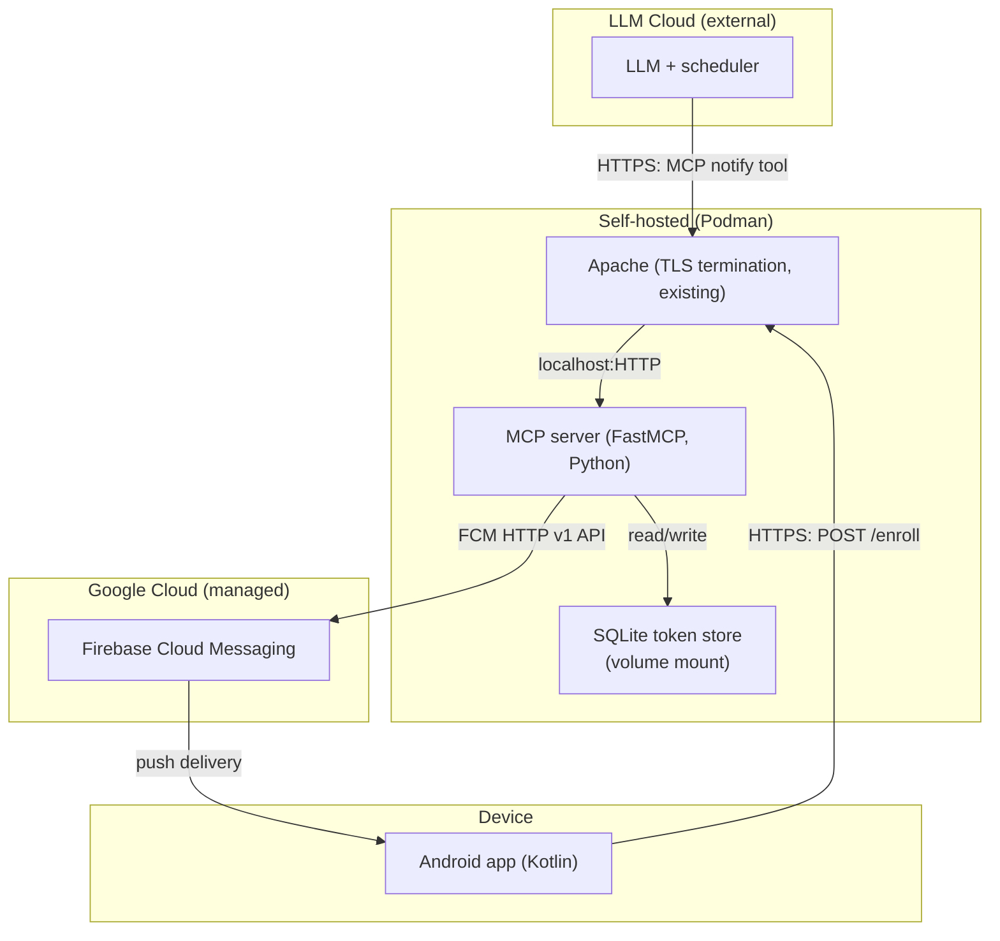
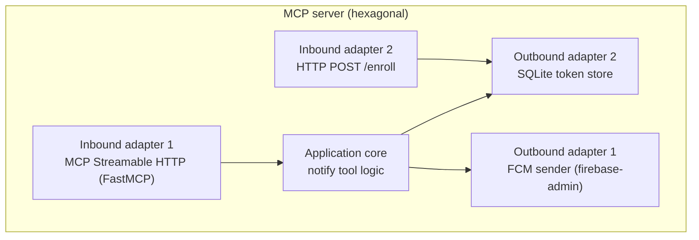

# mcp-notif — Solution Design

## 1. Overview

mcp-notif is an LLM-driven push notification system. The LLM is the decision engine — it decides when to notify, what to say, and how to formulate the message. A self-hosted MCP server acts as a bridge to Firebase Cloud Messaging. An Android app receives and displays the notification.

The system is intentionally minimal: the MCP server knows nothing about todo-lists, scheduling, or business logic. It exposes a single `notify` tool that accepts a title, a short message, and a detailed message, and pushes them to FCM. It also exposes an enrollment endpoint (`POST /enroll`) that the Android app calls to register its FCM device token — replacing the manual env-var configuration of the initial design. Any LLM with MCP connectivity can use it for any purpose.

### System flows

**Notification flow (forward):**

```
LLM scheduler fires
  -> LLM interrogates MCP connectors (todo-list, etc.)
  -> LLM analyzes and formulates notification (title, short_message, detailed_message)
  -> LLM calls MCP server: notify(title, short_message, detailed_message)
  -> MCP server validates input + authenticates bearer token (MCP_AUTH_TOKEN)
  -> MCP server reads device token from SQLite store
  -> MCP server pushes data-only FCM message via firebase-admin SDK
  -> FCM delivers push to Android device
  -> Android FirebaseMessagingService.onMessageReceived builds system notification
  -> User taps notification -> detail view shows detailed_message
```

**Enrollment flow (back-channel):**

```
Android app starts (or token rotates via onNewToken)
  -> Android app obtains FCM device token from Firebase SDK
  -> Android app POSTs to MCP server: POST /enroll { device_token }
  -> MCP server authenticates enrollment token (ENROLLMENT_TOKEN)
  -> MCP server writes token to SQLite store (INSERT OR REPLACE — overwrite)
  -> MCP server returns 200 { status: "enrolled" }
  -> Notify tool reads token from store on next call
```

### What each unit owns

| Unit | Owns | Does NOT own |
|---|---|---|
| LLM (cloud) | Scheduling, task analysis, notification formulation, retry decisions | Push delivery, device registration, token storage |
| MCP server (Podman) | Input validation, auth, FCM push, device token persistence (SQLite), enrollment endpoint, error reporting | Scheduling, business logic, notification history, session state |
| FCM (Google) | Message delivery, device token registration | Notification content, scheduling, token storage |
| Android app (device) | Notification display, device token generation + rotation detection, enrollment calls | Business logic, token storage, notify calls |

## 2. Architecture

### Design paradigm: Hexagonal (ports & adapters)

The MCP notification server uses a hexagonal architecture. The application core contains the `notify` tool logic (validation, FCM message construction). Inbound and outbound concerns are isolated behind adapter ports:

- **Inbound adapter 1:** MCP Streamable HTTP transport (FastMCP) — receives `notify` tool calls from the LLM
- **Inbound adapter 2:** HTTP POST `/enroll` endpoint — receives device-token enrollment from the Android app (plain HTTP, not MCP)
- **Outbound adapter 1:** FCM sender (firebase-admin SDK) — pushes messages to Firebase Cloud Messaging
- **Outbound adapter 2:** SQLite token store — persists the device token (read by notify, written by enrollment)

FastMCP 4.x generates a standard ASGI application. The server mounts FastMCP inside a FastAPI or Starlette app and adds `/enroll` as a custom route alongside the MCP transport — same process, same port.

The core has no knowledge of HTTP, MCP protocol, or FCM API details. This keeps the notify logic testable in isolation and allows either adapter to change without affecting the other.

### System topology



### Dependency direction

The notify flow is strictly one-way: `LLM -> MCP server -> FCM -> Android app`. The Android app makes no calls to the MCP server for notifications. Enrollment is the only permitted back-channel: `Android app -> MCP server /enroll`. The enrollment endpoint writes only to the token store; the notify tool reads only from the token store. No circular dependency exists — enrollment and notify never call each other.

### MCP server internal structure



### Source tree

```
mcp-notif/
  mcp-server/              # Python — MCP notification server
    src/
      core/                # notify tool logic (validation, message construction)
      adapters/
        inbound/           # MCP Streamable HTTP (FastMCP) + HTTP POST /enroll
        outbound/          # FCM sender (firebase-admin SDK) + SQLite token store
    Containerfile          # Podman image
  android-app/             # Kotlin — FCM receiver, detail view, enrollment on startup/token rotation
```

## 3. Key Contracts

### 3.1 notify tool input (AD-1)

The MCP `notify` tool accepts exactly three string fields:

| Field | Type | Max bytes (UTF-8) | Required |
|---|---|---|---|
| `title` | string | 100 | Yes, non-empty |
| `short_message` | string | 500 | Yes, non-empty |
| `detailed_message` | string | 3500 | Yes, non-empty |

The MCP server validates all field lengths before sending to FCM. Oversized payloads return a `validation_error` (see Error Handling). Limits account for FCM's 4 KB total data payload constraint.

### 3.2 FCM message contract (AD-2)

The MCP server sends an FCM **data-only** message — not a data+notification hybrid. This is a critical design decision: data-only messages guarantee `onMessageReceived` is invoked on the Android device regardless of app state (foreground or background). Hybrid messages have divergent delivery paths that break in background mode.

The FCM data payload:

```json
{
  "data": {
    "title": "...",
    "short_message": "...",
    "detailed_message": "..."
  }
}
```

The Android app's `FirebaseMessagingService.onMessageReceived`:
1. Reads `title` and `short_message` from `remoteMessage.data`
2. Builds a system notification using `NotificationCompat.BigTextStyle` (full text, no truncation)
3. Creates a PendingIntent with `detailed_message` as extra for the detail Activity
4. Notification channel: `IMPORTANCE_DEFAULT`, channel ID is an app-defined constant

The Android app MUST ignore any FCM data keys other than these three. The MCP server MUST NOT add extra data keys.

### 3.3 Enrollment endpoint (AD-12)

The MCP server exposes a plain HTTP endpoint — NOT an MCP tool — at `POST /enroll`. The Android app does not speak MCP; enrollment is a simple REST call.

**Request:**

```
POST /enroll
Authorization: Bearer <ENROLLMENT_TOKEN>
Content-Type: application/json

{
  "device_token": "<FCM token string>"
}
```

**Responses:**

| Status | Body | Condition |
|---|---|---|
| 200 | `{ "status": "enrolled" }` | Valid token, written to SQLite store |
| 401 | — | Missing or incorrect `ENROLLMENT_TOKEN` |
| 400 | — | Missing or empty `device_token` field |

The endpoint writes the token to the SQLite store using INSERT OR REPLACE (overwrite semantics — last enrollment wins). It MUST NOT accept any other fields in the body. It MUST NOT trigger a notification. It goes through Apache TLS termination like the MCP transport.

The `ENROLLMENT_TOKEN` is distinct from the `MCP_AUTH_TOKEN` used by the LLM, so the two can rotate independently.

### 3.4 SQLite token store (AD-13)

The device token is persisted in a SQLite file inside the container, on a volume mount so it survives restarts.

**Schema:**

```sql
CREATE TABLE IF NOT EXISTS device_token (
    id INTEGER PRIMARY KEY DEFAULT 1,
    token TEXT NOT NULL,
    enrolled_at TEXT NOT NULL  -- format: %Y-%m-%dT%H:%M:%SZ (UTC, second precision)
);
```

Single row enforced (`id=1`). Enrollment writes via `INSERT OR REPLACE`. Notify reads via `SELECT token FROM device_token WHERE id = 1`.

**Concurrency:** Every connection sets `PRAGMA journal_mode=WAL` and `PRAGMA busy_timeout=5000` to prevent SQLITE_BUSY errors from concurrent read-write access.

**Table creation:** The table is created at server startup, before either inbound adapter accepts requests.

**Error handling:**

| Condition | Error type (AD-8) | Action |
|---|---|---|
| Store empty, file missing, or table missing | `no_device_enrolled` | Do not retry; user must enroll a device |
| File present but corrupt (unopenable, query raises `DatabaseError`) | `store_unavailable` | Retry after backoff; operator must restore or delete the file |

### 3.5 Error handling (AD-8)

The MCP server does not retry on its own. If FCM push fails, it returns a structured error to the LLM, which decides retry or skip based on the error type:

| Error type | Source | Retry? |
|---|---|---|
| `validation_error` | Local pre-send input validation | No |
| `no_device_enrolled` | Token store empty or missing — no device enrolled | No (user action required) |
| `store_unavailable` | Local SQLite store inaccessible (corrupt, locked) | Yes, after backoff |
| `fcm_unregistered` | 404 (token invalid) | No |
| `fcm_invalid_argument` | 400 (payload rejected) | No |
| `fcm_permission_denied` | 403 (service account misconfigured) | No |
| `fcm_throttled` | 429 (rate limited) | Yes, after backoff |
| `fcm_internal` | 5xx (FCM internal) | Yes |
| `network_error` | Unreachable | Yes |

Error shape returned to LLM:
```json
{
  "error": {
    "type": "fcm_unregistered",
    "message": "Device token is no longer valid. The device must re-enroll via POST /enroll."
  }
}
```

Success returns:
```json
{
  "message_id": "projects/.../messages/..."
}
```

## 4. Security

### Authentication (AD-4, AD-12)

The MCP server is exposed to the internet (the LLM runs in a cloud service and needs to reach it). V1 uses two separate static bearer tokens:

- **`MCP_AUTH_TOKEN`** — validated on every MCP transport request (the `notify` tool). Sent by the LLM in the `Authorization: Bearer <token>` header.
- **`ENROLLMENT_TOKEN`** — validated on every `POST /enroll` request. Sent by the Android app. Separate from `MCP_AUTH_TOKEN` so the two can rotate independently.

Mismatch returns HTTP 401. Token rotation, mTLS, and rate limiting are deferred to V2+ when the threat model changes.

### Transport security (AD-9)

An existing Apache reverse proxy terminates TLS in front of the Podman container. The MCP server listens on localhost inside the container and never handles TLS directly. Apache is already in place — no additional reverse proxy is deployed.

### FCM authentication

The MCP server authenticates to FCM using a Firebase service account JSON file (path via `FCM_SERVICE_ACCOUNT_PATH` env var). The firebase-admin SDK handles OAuth2 token acquisition and refresh automatically. No bare API keys — FCM HTTP v1 requires service account credentials.

## 5. Device Token Lifecycle (AD-11, AD-12, AD-13)

The FCM device token is the link between the MCP server and the Android device. Its lifecycle is fully automated in V1:

1. **Generation:** Android app calls `FirebaseMessaging.getInstance().token` on first launch. Firebase SDK registers with FCM and returns a token.
2. **Enrollment:** Android app POSTs the token to the MCP server `/enroll` endpoint with the `ENROLLMENT_TOKEN`. The MCP server writes it to the SQLite token store (INSERT OR REPLACE — overwrite, last enrollment wins).
3. **Consumption:** On each `notify` call, the MCP server reads the token from the SQLite store and sends the FCM push to that token.
4. **Rotation:** If the token rotates (app reinstall, Firebase re-init), `FirebaseMessagingService.onNewToken` fires on the Android device. The app POSTs the new token to `/enroll` — same flow as initial enrollment. The old token is overwritten in the store.
5. **Staleness detection:** If FCM returns 404 (`UNREGISTERED`) for a token that was valid at enrollment time (e.g., the app was uninstalled and reinstalled without the server knowing), the MCP server propagates this as `fcm_unregistered` error type to the LLM. The next enrollment from the Android app will overwrite the stale token.
6. **Enrollment failure:** If the enrollment endpoint is unreachable, the Android app surfaces the failure to the user and retries with backoff.

The `enrolled_at` column in the SQLite store is metadata only and MUST NOT be used for staleness detection — FCM `UNREGISTERED` is the only staleness signal in V1.

## 6. Deployment & Operations

### Container architecture

```
Internet -> Apache (TLS, port 443, existing) -> MCP server (localhost:8080, inside Podman container)
                                                        |
                                                        v
                                              SQLite token store (volume mount: /data/device_token.db)
```

- **Podman container:** Runs the MCP server (Python + FastMCP + firebase-admin + sqlite3)
- **Volume mount:** `/data/device_token.db` persists the SQLite token store across container restarts
- **Apache:** Already in place, handles TLS termination and reverse proxy
- **Environment variables:** Injected into the container at startup
- **Startup:** Server creates the `device_token` table before accepting requests on either inbound adapter

### Configuration

| Env var | Used by | Purpose |
|---|---|---|
| `FCM_SERVICE_ACCOUNT_PATH` | MCP server | Path to Firebase service account JSON |
| `MCP_AUTH_TOKEN` | MCP server | Bearer token for LLM auth (notify tool) |
| `ENROLLMENT_TOKEN` | MCP server | Bearer token for Android app auth (enrollment endpoint) |
| `TOKEN_DB_PATH` | MCP server | SQLite token store path (optional, default `/data/device_token.db`) |

Android app uses standard `google-services.json` for Firebase configuration. It also stores the enrollment endpoint URL and `ENROLLMENT_TOKEN` in its config (e.g., `local.properties` or a config file bundled at build time).

### Logging (AD-10)

One structured JSON log line per `notify` call to stdout:

```json
{
  "request_id": "uuid",
  "timestamp": "2026-09-04T12:00:00Z",
  "result": "success|error",
  "error_type": "fcm_unregistered",
  "latency_ms": 142,
  "fcm_message_id": "..."
}
```

No file-based logging, no log aggregation in V1. Podman captures stdout.

### Health

No explicit health-check endpoint in V1. Apache connection errors serve as the liveness signal for a monouser single-container setup. Add a `/health` endpoint if monitoring needs grow.

## 7. Stack

| Component | Technology | Version |
|---|---|---|
| MCP server language | Python | 3.12+ |
| MCP framework | FastMCP | 4.x (ASGI, mounts inside FastAPI/Starlette) |
| FCM SDK | firebase-admin (Python) | 7.5.0 |
| MCP protocol | — | 2026-07-28 (stateless, Streamable HTTP) |
| Push delivery | FCM HTTP v1 API | current (service account OAuth2) |
| Token store | SQLite (stdlib `sqlite3`) | bundled with Python (WAL mode) |
| Android app language | Kotlin | latest stable |
| Android push SDK | Firebase Messaging | latest stable |
| Reverse proxy / TLS | Apache | already in place |
| Container runtime | Podman | latest stable |

## 8. What's Deferred

| Decision | Revisit when |
|---|---|
| Android app internal architecture (Activities, detail view, lifecycle, enrollment UI) | Android build starts |
| Multi-user, multi-device support | V2 scope (single-row token store; multi-row is the expansion point) |
| Notification actions (mark done, snooze, reply to LLM) | V2 scope |
| Notification history in app | V2 scope |
| Rate limiting, mTLS | Threat model changes |
| Container orchestration (Compose, pods) | Complexity grows beyond single container |
| Retry / dead-letter queue | FCM reliability proves insufficient |
| Health-check endpoint | Monitoring needs grow |

## 9. Design Decisions Summary

| ID | Decision | Why |
|---|---|---|
| AD-1 | Three-field notify tool with byte limits | Fixed contract for LLM; FCM 4KB limit |
| AD-2 | Data-only FCM messages (not data+notification) | Guarantees onMessageReceived in all app states |
| AD-3 | Minimal persistence (device token only) | Single SQLite table, single row; no session/history state |
| AD-4 | Static bearer token auth (MCP_AUTH_TOKEN) | Minimum viable protection for monouser internet-exposed server |
| AD-5 | Forward notify + back-channel enrollment | Notify one-way; enrollment is the only permitted back-channel |
| AD-6 | Explicit state ownership per unit | MCP server owns token persistence; Android owns token generation |
| AD-7 | Env var config (no FCM_DEVICE_TOKEN) | Token read from SQLite at runtime; ENROLLMENT_TOKEN added |
| AD-8 | Enumerated error types with retry semantics (9 types) | LLM can reliably decide retry vs. skip; includes store errors |
| AD-9 | TLS via existing Apache reverse proxy | MCP server never handles TLS; Apache already deployed |
| AD-10 | Structured JSON to stdout | Container-native; no log infra in V1 |
| AD-11 | Device token lifecycle via enrollment | onNewToken triggers POST /enroll; automated rotation in V1 |
| AD-12 | Enrollment endpoint (POST /enroll) | Plain HTTP, separate ENROLLMENT_TOKEN; Android doesn't speak MCP |
| AD-13 | SQLite token store (WAL, single row) | Volume-mounted persistence; concurrent-safe; startup-created |
